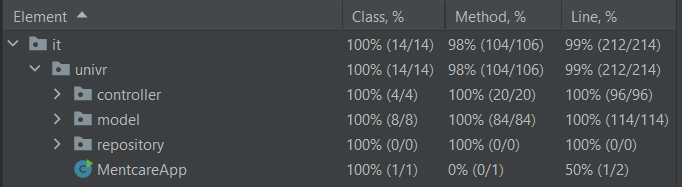

# Esame Fondamenti Ingegneria del Software
# Progetto Mentcare
### Bertelli Federico, matr: 472066

## Sommario
- [1. Requisiti](#requisiti)
- [2. Modulo sviluppato](#modulo-sviluppato)
- [3. Scenari](#scenari)
    - [3.1 Visualizza lista pazienti](#visualizza-lista-pazienti)
    - [3.2 Inserisci paziente](#inserisci-paziente)
    - [3.3 Modifica paziente](#modifica-paziente)
    - [3.4 Elimina paziente](#elimina-paziente)
    - [3.5 Visualizza lista prescrizioni](#visualizza-lista-prescrizioni)
- [4. Testing](#testing)
  - [4.1 Unit testing](#unit-testing)
  - [4.2 End-To-End testing](#end-to-end-testing)
  - [4.3 Code coverage](#code-coverage)
    

## Requisiti
Mentcare é un sistema informativo per la gestione di informazioni di pazienti con problemi di salute mentale in cura presso una clinica.

Gli obbiettivi del sistema sono quelli di: generare informazioni riguardanti i pazienti che consentono ai responsabili di prescrivere dei farmaci per poterli curare,
e di fornire l'accesso a queste informazioni alle diverse tipologie di utenti.

Il sistema dispone di un database centrale e l'accesso da host remoti, da cui è possibile effettuare diverse operazioni in base alla tipologia di utente che accede.

Il sistema quindi necessita dell'implementazione delle seguenti funzionalità:

- memorizzare le informazioni relative ai pazienti e di poterle visualizzare
- registrare le prescrizioni di farmaci ai pazienti e di poterle visualizzare
- premettere agli utenti di accedere a queste informazioni a seconda della tipologia di utente che effettua il login

Inoltre il sistema presuppone che le password degli utenti non siano salvate in chiaro all'interno della base di dati per evitare che l'amministratore di sistema possa modificarle.

Gli utenti sono quindi:
- Guest: l'ospite può solamente visualizzare le informazioni relative al proprio profilo;
- Admin: amministratore dell'intero sistema che può gestire le informazioni degli utenti;
- Doctor: ovvero i dottori possono gestire le informazioni dei pazienti e anche di gestire il lato delle loro prescrizioni;
- Office: quindi il personale amministrativo che si occupa gestione delle informazioni dei pazienti;

Infine tutti gli utenti possono visualizzare le informazioni relative al proprio profilo.

## Modulo sviluppato
E' stato sviluppato un singolo modulo dell'intero sistema cioè quello relativo al dottore già loggato.

## Scenari
### Visualizza lista pazienti

|                                | Descrizione                                                                                                                   |
|--------------------------------|-------------------------------------------------------------------------------------------------------------------------------|
| **Initial assumption**         | Il dottore si trova nella homepage.                                                                                           |
| **Normal function**            | Il dottore clicca sul link "Show Patient List" (rappresentato da un'immagine) e viene reindirizzato alla pagina dei pazienti. |
| **What can go wrong**          | -                                                                                                                             |
| **Other activities**           | -                                                                                                                             |
| **System state on completion** | -                                                                                                                             |

### Inserisci paziente

|                                | Descrizione                                                                                                                                                                                                                                                                              |
|--------------------------------|------------------------------------------------------------------------------------------------------------------------------------------------------------------------------------------------------------------------------------------------------------------------------------------|
| **Initial assumption**         | Il dottore si trova nella homepage.                                                                                                                                                                                                                                                      |
| **Normal function**            | Il dottore clicca sul link "Create New Patient" (rappresentato da un'immagine) e viene reindirizzato alla pagina dedicata contenente il form per l'inserimento del nuovo paziente. Una volta inseriti i dati clicca sul pulsante "Create" e viene reindirizzato alla lista dei pazienti. |
| **What can go wrong**          | Se non vengono compilati tutti i campi nelle rispettive forme verrà visualizzata la pagina di errore.                                                                                                                                                                                    |
| **Other activities**           | -                                                                                                                                                                                                                                                                                        |
| **System state on completion** | Il paziente viene aggiunto al database.                                                                                                                                                                                                                                                  |

### Modifica paziente

|                                | Descrizione                                                                                                                                                                                                                                                                                                                                                                                                                                                      |
|--------------------------------|------------------------------------------------------------------------------------------------------------------------------------------------------------------------------------------------------------------------------------------------------------------------------------------------------------------------------------------------------------------------------------------------------------------------------------------------------------------|
| **Initial assumption**         | Il dottore si trova nella homepage.                                                                                                                                                                                                                                                                                                                                                                                                                              |
| **Normal function**            | Il dottore clicca sul link "Show Patient List" (rappresentato da un'immagine) e viene reindirizzato alla pagina dei pazienti. Poi individua il paziente che vuole modificare e clicca sul pulsante “Edit” relativo. Viene visualizzato un form analogo a quello della "Create New Patient" ma precompilato con i dati del paziente che si sta modificando. Una volta modificati i dati clicca sul pulsante "Edit" e viene reindirizzato alla lista dei pazienti. |
| **What can go wrong**          | Se tutti i campi vengono lasciati vuoti verrà visualizzata la pagina di errore.                                                                                                                                                                                                                                                                                                                                                                                  |
| **Other activities**           | -                                                                                                                                                                                                                                                                                                                                                                                                                                                                |
| **System state on completion** |  La versione originale del paziente viene eliminata e sostituita con la nuova.                                                                                                                                                                                                                                                                                                                                                                                                                                                                |

### Elimina paziente

|                                | Descrizione                                                                                                                                                                                                                                                              |
|--------------------------------|--------------------------------------------------------------------------------------------------------------------------------------------------------------------------------------------------------------------------------------------------------------------------|
| **Initial assumption**         | Il dottore si trova nella homepage.                                                                                                                                                                                                                                      |
| **Normal function**            | Il dottore clicca sul link "Show Patient List" (rappresentato da un'immagine) e viene reindirizzato alla pagina dei pazienti. Poi individua il paziente che vuole eliminare e clicca sul pulsante “Delete” relativo. Quindi viene reindirizzato alla lista dei pazienti. |
| **What can go wrong**          | -                                                                                                                                                                                                                                                                        |
| **Other activities**           | -                                                                                                                                                                                                                                                                        |
| **System state on completion** | Il paziente viene eliminato dal database.                                                                                                                                                                                                                                |

### Visualizza lista prescrizioni

|                                | Descrizione                                                                                                                              |
|--------------------------------|------------------------------------------------------------------------------------------------------------------------------------------|
| **Initial assumption**         | Il dottore si trova nella homepage.                                                                                                      |
| **Normal function**            | Il dottore clicca sul link "Show Prescription List" (rappresentato da un'immagine) e viene reindirizzato alla pagina delle prescrizioni. |
| **What can go wrong**          |                                                                                                                                          |
| **Other activities**           |                                                                                                                                          |
| **System state on completion** |                                                                                                                                          |

## Testing
### Unit testing
Sono stati eseguiti test per ogni singolo model del sistema, testando tutti i metodi presenti.

### End-To-End testing
Per ogni scenario descritto in precedenza questi sono i test ad esso collegati.

**Class:** [IndexTest](https://github.com/fedebert-cmd/Mentcare/blob/master/app/src/test/java/it/univr/ui/IndexTest.java)

_testIndexPage_ &rarr; Controlla se ci si trova effettivamente nella homepage.

_testButtonShowPatientList_ &rarr; Controlla se dopo aver premuto il bottone "Show Patient List" ritorni la pagina della lista dei pazienti.

_testButtonCreateNewPatient_ &rarr; Controlla se dopo aver premuto il bottone "Create New Patient" ritorni la pagina per la creazione nuovi pazienti.

_testButtonShowPrescriptionList_ &rarr; Controlla se dopo aver premuto il bottone "Show Prescription List" ritorni la pagina della lista delle prescrizioni.

**Class** [ListTest](https://github.com/fedebert-cmd/Mentcare/blob/master/app/src/test/java/it/univr/ui/ListTest.java)

_testListPage_ &rarr; Controlla se ci si trova effettivamente nella pagina della lista pazienti.

_testButtonEdit_ &rarr; Controlla se dopo aver premuto il bottone "Edit" ritorni la pagina relativa alla modifica paziente.

_testButtonDelete_ &rarr; Controlla se dopo aver premuto il bottone "Delete" ritorni la pagina della lista pazienti.

_testButtonHome_ &rarr; Controlla se dopo aver premuto il bottone "Homepage" ritorni alla pagina iniziale.

**Class** [InputTest](https://github.com/fedebert-cmd/Mentcare/blob/master/app/src/test/java/it/univr/ui/InputTest.java)

_testInputPage_ &rarr; Controlla se ci si trova effettivamente nella pagina di inserimento nuovo paziente.

_testAddPatient_ &rarr; Aggiunge un nuovo paziente e controlla dalla pagina della lista dei pazienti se tutti i dati inseriti coincidono.

**Class** [EditTest](https://github.com/fedebert-cmd/Mentcare/blob/master/app/src/test/java/it/univr/ui/EditTest.java)

_testEditPage_ &rarr; Controlla se ci si trova effettivamente nella pagina di modifica di un paziente.

_testEditPatient_ &rarr; Dalla pagina della lista pazienti preme il bottone "Edit" e modifica i valori del paziente. Poi controlla se i dati inseriti coincidono.

**Class** [PrescriptionTest](https://github.com/fedebert-cmd/Mentcare/blob/master/app/src/test/java/it/univr/ui/PrescriptionTest.java)

_testPrescriptionPage_ &rarr; Controlla se ci si trova effettivamente nella pagina della lista delle prescrizioni.

_testButtonHome_ &rarr; Controlla se dopo aver premuto il bottone "Homepage" ritorni alla pagina iniziale.

### Code coverage
E' stata verificata la code coverage dei test attraverso il tool integrato di IntelliJ. Questa è la code coverage raggiunta:

